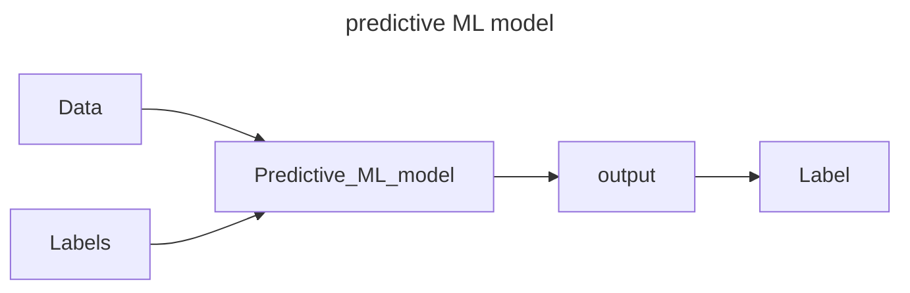
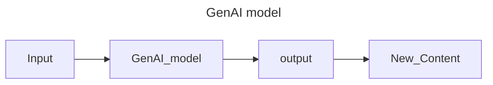

- AI is a discipline like physics. AI is a branch of computer science, with the creation of intelligence agents, which are system that can reason, and learn and act autonomously. 

- foundation Models:
	- A foundation model is a large AI model pretrained on a vast quantity of data that was "Designed to be adapted" (or fine-tuned) to a wide range of downstream tasks, such as sentiment analysis, image captioning and object recognition.

- Generative AI is a type of artificial intelligence (AI) that can create new content, such as text, images, audio, and video. It does this by learning from existing data and then using that knowledge to generate new and unique outputs.

- the 2 most common classes of machine learning models are unsupervised and supervised ML models.
	- Supervised: have labels
		- labeled data comes with a tag that is like a name, a type or a number. 
		- Unlabeled data is data that comes with no tag. 
		- supervised learning implies that the data is already labeled. 
		- In supervised learning we are learning from past examples to predict future values.
	- Unsupervised learning:
		- unsupervised learning implies the data is NOT labeled.
		- unsupervised problems are all about looking at the raw data, and seeing if it naturally falls into groups.
- Deep learning is a subset of Machine learning
- AI
	- Machine learning
		- supervised learning
		- unsupervised learning
		- reinforcement learning
			- Deep learning

- Deep learning uses artificial neural networks - allowing them to process more complex patterns than traditional machine learning.
- In semi-supervised learning, a neural network is trained on a small amount of labeled data and a large amount of unlabeled data.

### Generative AI 
- is a subset of Deep Learning
- Uses artificial neural networks
- processes labeled and unlabeled data

### Deep Learning Model Types
#### Discriminative
- Used to classify or predict
- Typically trained on a dataset of labeled data
- Learns the relationship between the features of the data points and the labels

#### Generative
- Generates new data that is similar to data it was trained on
- Understands distribution of data and how likely a given example is
- Predict next word in a sequence

- Discriminative -> classify -> Discriminative model (Classify if image is a dog or a cat)
- Generative Technique -> classify image -> Generative model (Generate and create a image of a dog)
- generative is NOT a number/prediction/class/probability
- generative IS image/audio/natural Language
- y = f(x)

### What is Generative AI
- GenAI is a type of Artificial intelligence that creates new content based on what it has learned from existing content.
- The process of learning from existing content is called training and results in the creation of a statistical model.
- When given a prompt, GenAI uses this statistical model to predict what an expected response might be-and this generates new content.
- Language
	- Generative language models learn about patterns in language through training data.
	- Then, given some text predict what comes next.
- Image models:
	- Generative image models produce new images using techniques like diffusion.
	- Then, given a prompt or related imagery, they transform random noise into images or generate image from prompts
- Transformers: 
	- a transformer takes input that has a encoder and decoder. 
	- encodes the input sequence, then passes it to the decoder to decode the representation 
- Hallucinations: creates output that might not make sense.
	- caused my dirty/noisy data
	- not enough context 
	- or the model is not given enough constraints
	- Not trained enough